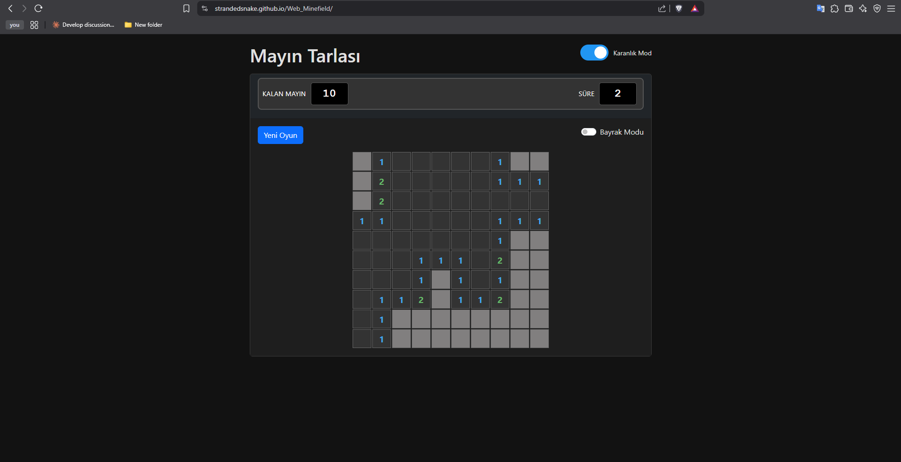

# Mayın Tarlası Oyunu

Bu proje, klasik Mayın Tarlası (Minesweeper) oyununun modern web teknolojileri ile geliştirilmiş bir versiyonudur. Türkçe arayüze sahip, özelleştirilebilir zorluk seviyesi ve karanlık mod desteği gibi özellikler içerir.



## Özellikler

- 🎮 Klasik Mayın Tarlası oyun deneyimi
- 🌗 Karanlık mod / Aydınlık mod desteği
- ⚙️ Özelleştirilebilir zorluk seviyeleri
  - Tablo boyutu: 5x5 ile 20x20 arası ayarlanabilir
  - Mayın sayısı: 5 ile 99 arası ayarlanabilir
  - Hazır zorluk seviyeleri: Kolay, Orta, Zor
- 🎯 Bayrak modunda kolay işaretleme
- ⏱️ Dijital göstergeler
  - Oyun süresi sayacı
  - Kalan mayın göstergesi
- 💫 Dalga efekti ve animasyonlar
- 📱 Tüm cihazlarda duyarlı tasarım

## Nasıl Oynanır

1. Oyunun zorluk ayarlarını belirleyin:
   - Tablo boyutunu seçin (5-20 arası)
   - Mayın sayısını seçin (5-99 arası)
   - Veya hazır zorluk seviyelerinden birini seçin: Kolay, Orta, Zor
2. "Oyunu Başlat" düğmesine tıklayın.
3. Oyun tahtasındaki hücreleri tıklayarak açın:
   - İlk tıklamanızda hiçbir zaman mayına denk gelmezsiniz
   - Tıkladığınız hücrede mayın yoksa, hücre açılır ve etrafındaki mayın sayısını gösterir
   - Eğer açtığınız hücrenin çevresinde hiç mayın yoksa, çevresindeki boş hücreler otomatik olarak açılır
4. Mayın olduğunu düşündüğünüz hücreleri işaretlemek için:
   - Sağ tıklayın veya
   - "Bayrak Modu" seçeneğini işaretleyip sol tıklayın
5. Tüm mayınsız hücreleri açtığınızda oyunu kazanırsınız!
6. Bir mayına tıklarsanız oyunu kaybedersiniz.

## Kurulum

1. Repo'yu klonlayın:
   ```
   git clone https://github.com/kullanici-adi/mayin-tarlasi.git
   ```
2. Proje dizinine gidin:
   ```
   cd mayin-tarlasi
   ```
3. Tüm dosyaları bir web sunucusunda barındırın veya doğrudan açın:
   ```
   index.html
   ```

## Teknolojiler

- HTML5
- CSS3 (Özel değişkenler ve animasyonlar)
- JavaScript (ES6+)
- Bootstrap 5.3.0

## Proje Yapısı

```
mayin-tarlasi/
│
├── index.html       # Ana HTML dosyası
├── styles.css       # CSS stil dosyası
├── script.js        # Oyun mantığı ve işlevselliği
└── sounds/          # Oyun ses efektleri
    ├── snakedie.mp3
    └── mgs-snake-eater-ending-ringtone.mp3
```

## Özelleştirme

### Temalar
Oyun, karanlık ve aydınlık olmak üzere iki tema seçeneği sunar. Temalar arasında geçiş yapmak için oyun başlığının yanındaki tema değiştiriciyi kullanabilirsiniz.

### Zorluk Ayarları
Oyun zorluk seviyesini tablo boyutu ve mayın sayısını değiştirerek özelleştirebilirsiniz:
- **Kolay:** 8x8 tablo, 10 mayın
- **Orta:** 12x12 tablo, 30 mayın
- **Zor:** 16x16 tablo, 60 mayın
- **Özel:** 5-20 arası tablo boyutu, 5-99 arası mayın sayısı

## Katkıda Bulunma

1. Bu repo'yu forklayın
2. Yeni bir özellik branch'i oluşturun (`git checkout -b yeni-ozellik`)
3. Değişikliklerinizi commit edin (`git commit -am 'Yeni özellik: XYZ'`)
4. Branch'inizi push edin (`git push origin yeni-ozellik`)
5. Bir Pull Request açın

## Lisans

Bu proje MIT lisansı altında lisanslanmıştır 

## İletişim

Sorularınız veya önerileriniz için eposta ile iletişime geçebilirsiniz.

---

Mayın Tarlası Oyunu - Keyifli oyunlar dileriz! 💣
